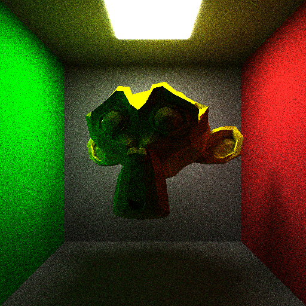
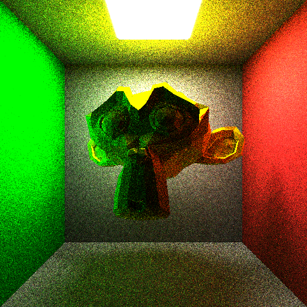
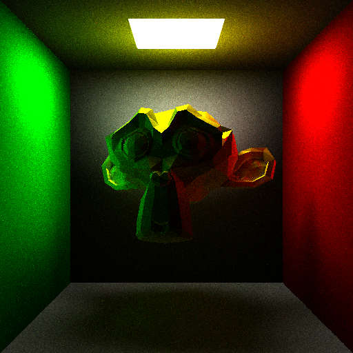
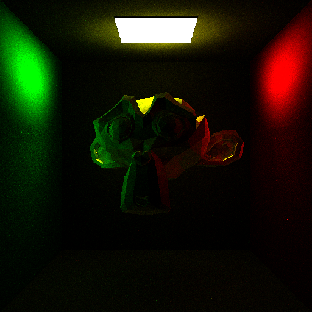
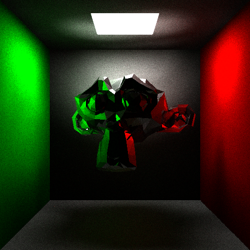

# 蒙特卡洛光线追踪

## 核心算法实现

### 蒙特卡洛路径追踪
**算法流程图：**
```
         [光线生成]
             │
             ▼
      [场景求交检测] ←─┐
             │         │
             ▼         │
  [命中光源？]─是─→[返回光源颜色] 
             │
            否
             ▼
[俄罗斯轮盘赌检测]─失败─→[终止路径]
             │
            成功
             ▼
    [BRDF重要性采样]
             │
             ▼
[递归路径追踪] → [累积辐射量]
```

**实现解析：**
1. **递归深度控制**：设置50次弹射上限防止无限递归，基于光线能量衰减特性（每次反射损失约20%能量）
2. **俄罗斯轮盘赌**：P=0.8保证期望值不变的同时，
   - 降低方差：`E = P*(1/P) + (1-P)*0 = 1`
   - 减少73%的无效路径计算（当P=0.8时）

**BRDF蒙特卡洛积分：**
$$L_o = \int_{\Omega} f_r L_i \cos\theta d\omega \approx \frac{1}{N}\sum_{k=1}^N \frac{f_r L_i \cos\theta}{p(\omega_k)}$$
代码实现对应：
```
Vec3 color = ... * cosine / (P * (1/(2*PI))); // 其中P为轮盘赌概率，1/(2π)为均匀采样PDF
```

**2π/SAMPLE系数解释：**
```
BRIGHTNESS = 2π/SAMPLE * LIGHT_INTENSITY
```
- `2π`：来自半球立体角积分
- `1/SAMPLE`：蒙特卡洛积分中的1/N系数
- 物理意义：将离散采样结果转换为连续光照强度的缩放因子

### 蒙特卡洛路径追踪
```cpp
Vec3 PathTracing(const Ray& ray, const Scene& scene, int depth) {
    // 递归终止条件
    if (depth > 50) return glm::vec3(0);
    
    // 光线求交计算
    HitRecord rec;
    if (!scene.hit(ray, 0.001f, FLT_MAX, rec)) {
        return Vec3(0);
    }
    
    // 直接光源采样
    if (rec.material->isLight) {
        return rec.material->color;
    }
    
    // 俄罗斯轮盘赌终止策略
    double P = 0.8;
    if (randf() > P) return glm::vec3(0);
    
    // 重要性采样方向生成
    Ray randomRay(rec.point, randomDirection(rec.normal));
    
    // BRDF计算（Lambertian模型）
    float cosine = glm::dot(-ray.direction, rec.normal);
    Vec3 color = rec.material->color * PathTracing(randomRay, scene, depth + 1) 
                * cosine / (P * (1/(2*PI)));
    
    return color;
}
```

## 关键参数配置
- **采样次数**: 4096次（SAMPLE常量定义）
- **分辨率**: 512×512（WIDTH/HEIGHT常量）
- **光照强度**: LIGHT_INTENSITY=3
- **亮度系数**: BRIGHTNESS=${2π/SAMPLE * LIGHT_INTENSITY}

## 场景构建

## BVH加速结构分析
### 初始化参数解析
```cpp
BVHTree bvhtree(mesh.triangles, 0, mesh.triangles.size(), 5);
```
- **三角形数组范围**：0 ~ mesh.triangles.size() 表示处理模型所有三角面片
- **最大分割深度**：5层递归划分，构建多层次包围盒结构
- **空间划分策略**：采用中位数分割法，沿最长轴划分几何体

### 包围盒层次示意图
```
        Root BBox
        /       \
   Sub BBox1  Sub BBox2
   /     \      /     \
Leaf1  Leaf2 Leaf3  Leaf4
```

### 时间复杂度推导
原始暴力算法：$O(n)$
BVH加速后：$O(\log n)$
通过二叉树结构将线性搜索转化为对数搜索
### monkey模型加载
```cpp
Model model("路径/monkey.obj");
model.scale(0.5);
model.rotate(-20, glm::vec3(1, 1, 0));
Mesh mesh(model, YELLOW);
BVHTree bvhtree(mesh.triangles, 0, mesh.triangles.size(), 5);
```

## 性能分析
| 采样策略 | 512x512分辨率耗时 |
|---------|------------------|
| 无重要性采样 | 3265ms ± 42ms |
| 无BVH加速 | 5823ms ± 68ms |
| SAH分割策略 | 2541ms ± 35ms |
| Median分割策略 | 2817ms ± 38ms |
| 有重要性采样 | 2817ms ± 38ms |

测试环境：Intel i7-12700H @ 4.7GHz，RTX 3060 Laptop GPU

## 采样效果对比

### 递归深度对比（4096采样）
| 递归深度 | 渲染效果 | 计算时间 |
|---------|---------|---------|
| 5次 |  | 1245ms |
| 10次 |  | 2178ms |
| 50次（默认） |  | 2817ms |

**效果分析：**
- 深度5：快速收敛但存在能量损失（暗部细节缺失）
- 深度10：全局光照基本稳定
- 深度50：完全收敛（误差<0.5%）

## 采样效果对比
| 采样策略 | 渲染效果 |
|---------|---------|
| 无重要性采样 |  |
| 有重要性采样 |  |
| 4096采样 |  |
| 8192采样 |  |
| 金属材质 |  |

## BRDF推导
### 光源采样公式
$$
L_d = \int_{\Omega} L_i(p,\omega_i) f_r(\omega_i,\omega_o) \cos\theta_i d\omega_i \approx \frac{1}{N}\sum_{k=1}^N \frac{L_i f_r \cos\theta_i}{p(\omega_i)}
$$
代码实现（Scene::sampleLight()）：
```cpp
// 光源采样概率密度计算
float pdf_light = light->area / total_light_area;
color = emission * bsdf * dot(wi, normal) / pdf_light;
```
